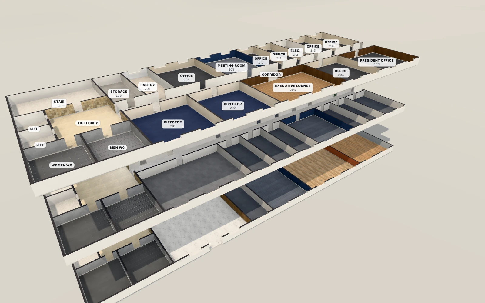
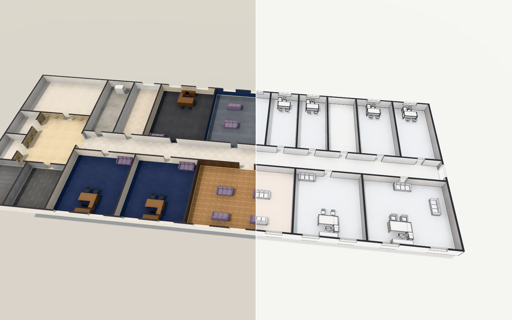
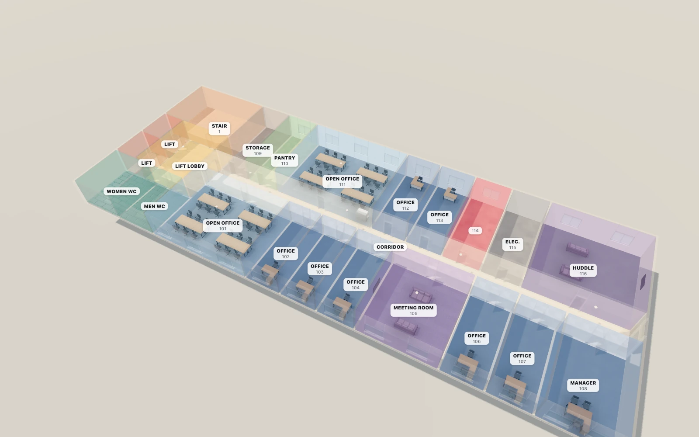
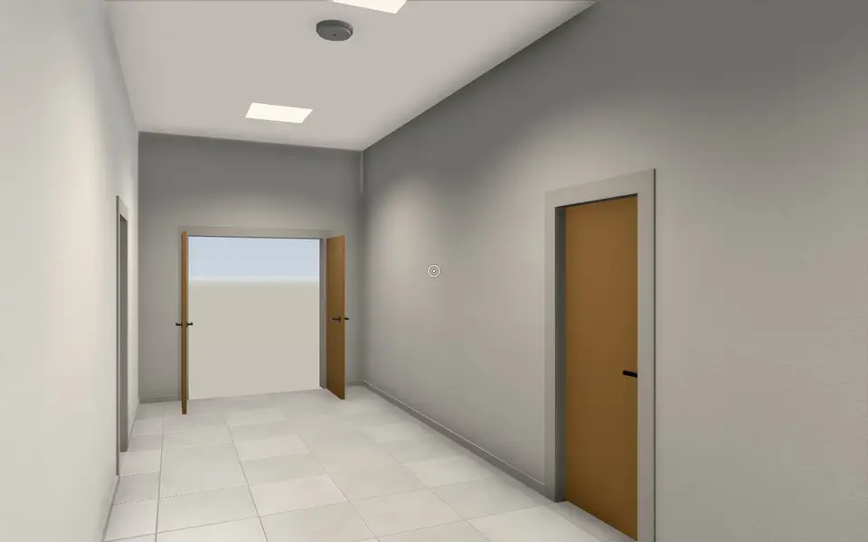
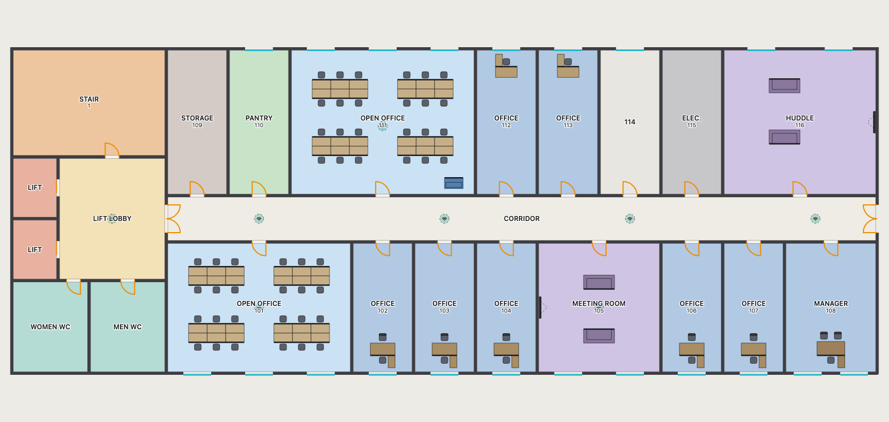

<h1 align="center">StoreyPath Viewer</h1>

<p align="center">
  <b>The StoreyPath package format, and everything that reads it.</b><br>
  A 3D world you can orbit and walk through, a 2D plan that needs no GPU, the way from a
  kiosk to an office, and a Go reader: for any web app or system that wants indoor maps
  with IDs that never change.
</p>

<p align="center">
  
</p>

A `.storeypath` package is one building as plain JSON, GeoJSON and CSV in a ZIP: its
floors, rooms and zones, doors and windows, furniture and equipment with their asset tags,
floor and wall finishes, and the walking network between them. Every object has an ID
that never changes. Packages are made with
[StoreyPath Studio](https://github.com/StoreyPath/storeypath-studio), which pins a version
of this repository, so a package and the code that reads it always agree.

| Folder | What it is |
|---|---|
| [spec/](spec) | **The format**: [FORMAT.md](spec/FORMAT.md) (format 0.9), JSON Schemas, the list of finishes, and conformance packages with the ways every reader must find the same |
| [viewer/](viewer) | **The viewers**, to embed in a web app: the 3D world, a map view, the 2D plan ([viewer/svg](viewer/svg)) that needs no WebGL, and finding the way ([viewer/src/navigation.js](viewer/src/navigation.js)) |
| [go/](go) | **A Go module** that reads and validates packages and finds the way in a building, standard library only |

## The 3D world



`StoreyPathWorld` builds a building from its package alone: walls at the thickness they
were drawn, doors with architraves and handles, windows with glass, skirting, furniture
with its chairs (each desk with what its grade has), floors and walls in their finishes,
under a sun with soft shadows. Two looks, one call apart: **Real** or **Model**, an
architect's white model with its edges drawn; and a quality that suits the machine (Auto
takes Low on built-in, virtual or software graphics). Orbit it as a dollhouse, one floor
or all, cut away, lifted apart, or in x-ray:



```js
import { StoreyPathWorld } from "./storeypath-viewer/src/world/world.js";

const world = new StoreyPathWorld("#world", { style: "real" });
await world.open("/files/main-building.storeypath");
world.setFloor("CAMP05-CAMPUS-MAIN-F02");
world.setCutaway(true);
world.select("CAMP05-CAMPUS-MAIN-F02-0127");   // fly to the president's office
```

### Walk through it, doors and all

<p align="center">
  
</p>

`world.setMode("walk")` starts at the front door: mouse to look, W A S D to move, and
walls, windows and shut doors in the way. A door opens as you walk into it, or with E or a
click at the cross (`setDoors("manual")`: only those); a page opens and shuts doors itself
with `setDoorOpen(id, open)` and hears them with the `dooraim` and `doorchange` events. At
stairs and lifts, `changeFloor(+1)` takes you up.

## The 2D plan, for any machine



`FloorPlanEngine` ([viewer/svg](viewer/svg)) draws one floor as a plain SVG plan: rooms by
type, doors with their swings, windows, items, a search, the way drawn on it. No WebGL and
no dependencies, for machines with no GPU (VDI desktops, kiosks). Strict TypeScript, with
its own build and tests.

## Finding the way

Every package carries its building's walking network (`navigation.json`): its doors and
openings, a point in each room, the lifts and stairs on each floor, its entrances and
kiosks. `route(pkg, from, to, { accessible })` finds the quickest way between any two of
them, or the one without stairs, with its line on each floor and steps ready to show; the
3D world and the plan draw it (`showRoute`). The Go module finds the same way, and
[spec/conformance/routes.json](spec/conformance) holds ways every reader must agree on.
<!-- route pictures: to take once the wayfinding redesign has landed (Studio's docs/media/capture.mjs) -->

```js
import { route } from "./storeypath-viewer/src/navigation.js";
const way = route(pkg, "7K2Q-XM9F-4DP", "CAMP05-CAMPUS-MAIN-F02-0127", { accessible: true }); // from a kiosk
world.showRoute(way, { fly: true });
```

## The Go reader

```go
import storeypath "github.com/storeypath/storeypath-viewer/go"

pkg, err := storeypath.Open("main-building.storeypath")
for _, p := range pkg.Validate() { … }                  // problems, each with a stable code
for _, u := range pkg.UnitsOn(floorID) { … }            // the rooms and zones people are placed in
way, err := pkg.Route(kioskItemID, officeID, storeypath.RouteOptions{Accessible: true})
```

Buildings, floors, spaces, zones and openings with their IDs, items and their catalogue,
capacities and grades, finishes, lifts' and stairs' stacks, and the way: standard library
only. [go/README.md](go/README.md).

## Use it

The viewers are plain ES modules: serve them, or install `@storeypath/viewer-world` (the 3D
world as one module, three.js inside: [viewer/world](viewer/world)) and
`@storeypath/viewer-svg` (the 2D plan). Nothing is downloaded at run time: they work
offline. Every option, method and event: [viewer/README.md](viewer/README.md).

```sh
cd viewer/svg && npm ci && npm test      # the 2D plan
cd viewer/world && npm ci && npm test    # the 3D world (headless Chrome)
cd go && go test ./...                   # the Go reader
node spec/finishes.mjs --check           # the finishes' copies agree with spec/finishes.json
```

The pictures here are of StoreyPath Studio's demo campus (all of it made up), taken by
Studio's `docs/media/capture.mjs viewer`.

## Coming

A standalone viewer app (2D, 3D, walking and navigation in one view, read-only),
installable on phones and tablets and usable as a kiosk, built from these viewers.

## Licence

Apache 2.0 ([LICENSE](LICENSE)). The vendored libraries keep their own licences
([viewer/vendor](viewer/vendor)).
